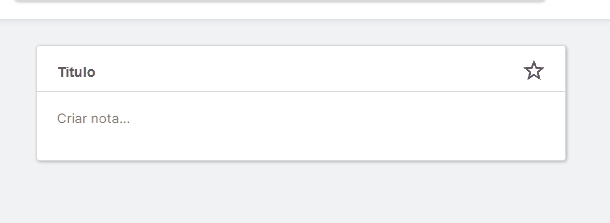
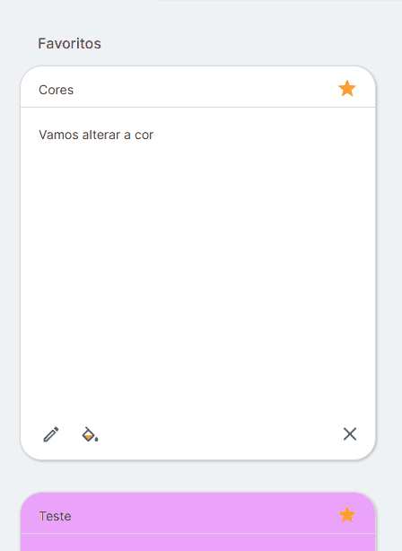
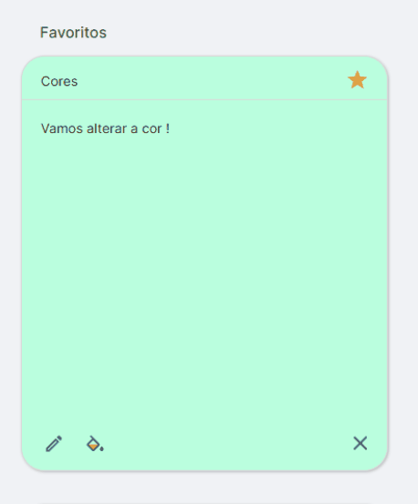

<h1 align="center"> Desafio Corelab  </h1>

## 💻 Projeto

Desenvolvimento de um aplicativo Web responsivo para gerenciamento de listas de tarefas, com página construída em React e uma API em Node.js para armazenar e gerenciar as listas

Deploy feito na vercel: https://corelab-web-challenge.vercel.app/

  Repositório do BackEnd: https://github.com/Wallace-Bezerra/corelab-api-challenge

 

  

## 🚀 Tecnologias

  Esse projeto foi desenvolvido com as seguintes tecnologias no Front End:

- [Next](https://nextjs.org/) ( SSR, Custom Hooks, React Hook Form, React Query (data-fetching e Cache), zustand e zod)
- [TypeScript](https://www.typescriptlang.org/)
- [Styled Components](https://styled-components.com/)
- [Framer Motion](https://www.framer.com/motion/)

 

---

* O aplicativo inclui um recurso dinâmico de criação de novas tarefas, com a opção de marcá-las como favoritas e validações integradas

  

* Temos a possibilidade edição completa das tarefas e personalização da cor a cada uma delas

  

    
    
  

* O aplicativo apresenta um recurso de busca avançada, permitindo aos usuários pesquisar tarefas por título, conteúdo ou cor associada. Isso facilita a localização de tarefas específicas, mesmo em listas extensas, proporcionando uma experiência de organização mais eficiente.
  
* Utilizei o zustand para guardar o busca em um estao global podendo compartilhar com o restante dos componentes

  

## 📱 Mobile

* O aplicativo se ajusta automaticamente para oferecer uma experiência de uso otimizada, independentemente do dispositivo utilizado pelos usuários, garantindo uma visualização e interação perfeitas em smartphones, tablets e desktops."
  

  

---

Feito com ♥ by Wallace Bezerra

  

